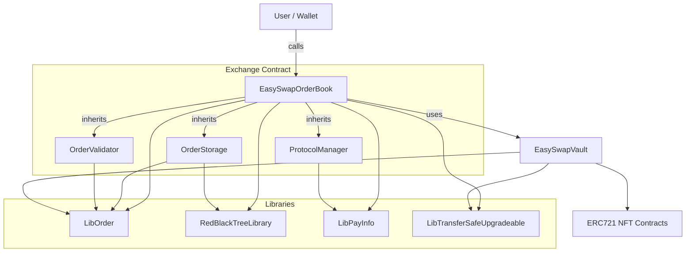
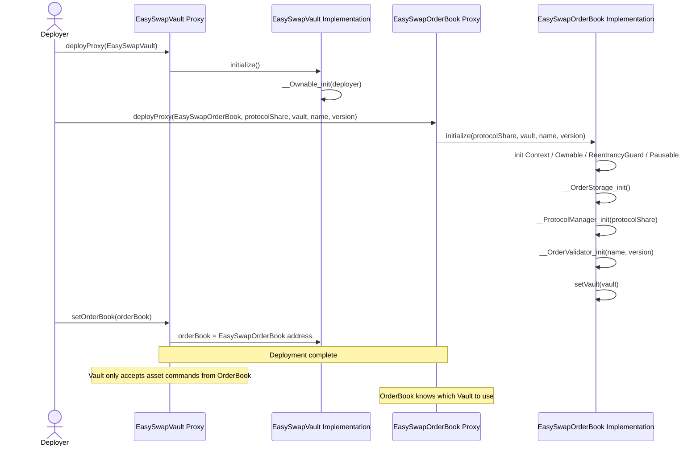
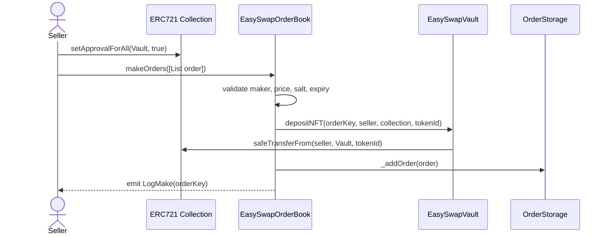
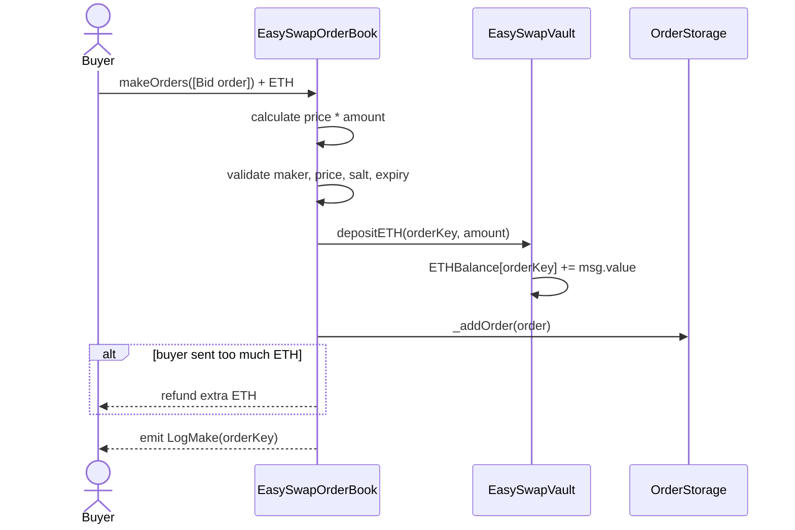
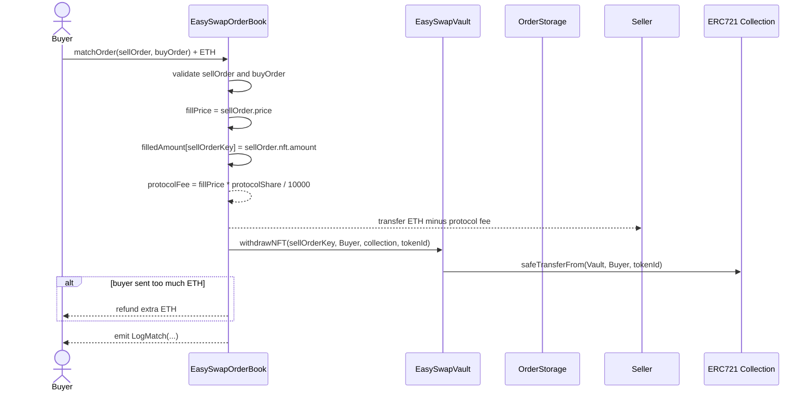
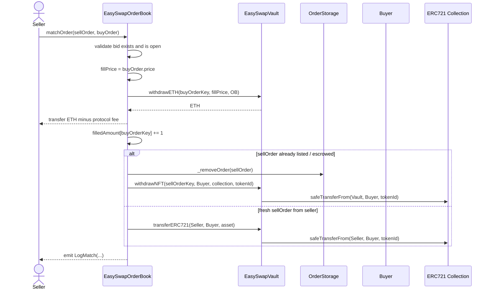
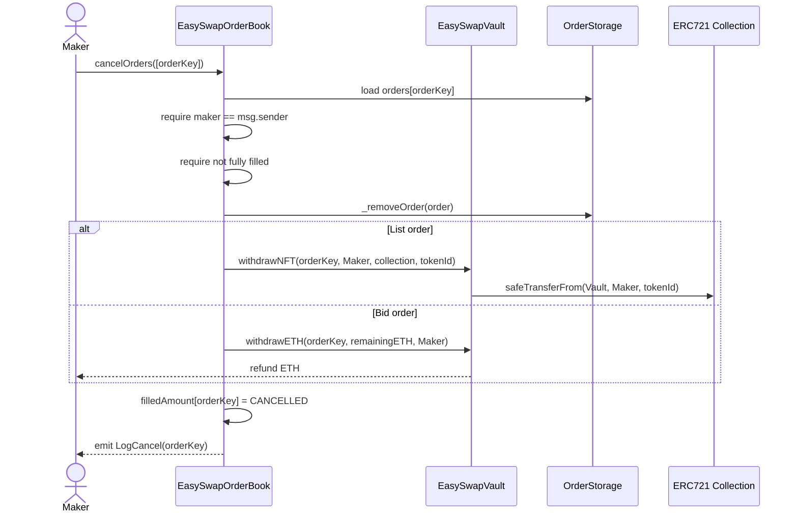
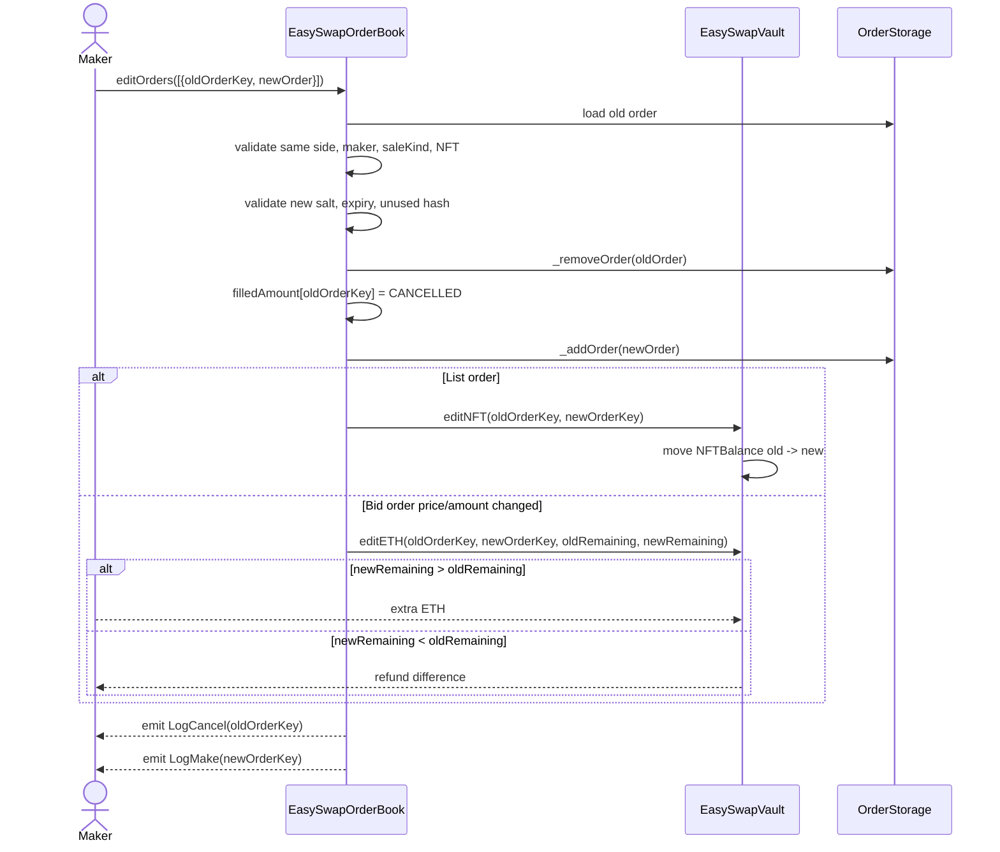
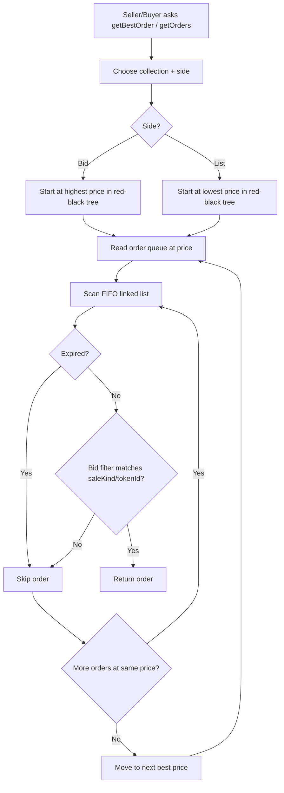

# EasySwap
## Overview
This is an on-chain ERC721 orderbook split into four modules:
- `EasySwapOrderBook` is the facade/exchange contract. Users call it to create, cancel, edit, match, batch-match orders.
- `EasySwapVault` is the escrow contract. **Ask/offer** orders escrow NFTs; **Bid** orders escrow ETH. Only the configured orderbook can withdraw/deposit/edit escrow balances.
- `OrderStorage` is the order index. Orders are stored by `OrderKey`, and indexed by `collection->side->price`. And orders at the same price are a linked queue. Prices are kept in a red-black tree. Bid side chooses the highest price first; Ask/Offer side chooses the lowest price first.
- `ProtocolManager` stores protocol fee share in basis points.

## Confusing Terminology

| Action | Stock Market Term | NFT Marketplace Term |
| :--- | :--- | :--- |
| **Wanting to Sell** | Ask / Offer | **List** (Listing Price) |
| **Wanting to Buy** | Bid | **Offer** / Bid |

## Order Types
- List order: Seller locks one ERC721 in the vault and waits for a buyer.
- Offer order: Buyer locks ETH in the vault and waits for a seller. A buyer pre-creates/deposits a Bid order when they are not doing “buy now,” but making an offer.
    - `FixedPriceForItem`: order targets a specific tokenId.
    - `FixedPriceForCollection`: bid can match any token in the collection.

## Data Structure
- OrderKey:
```
orderKey = hash(side, saleKind, maker, nft, price, expiry, salt)
```
- Storage shape:
```
orders[orderKey] = DBOrder(order, next)

priceTrees[collection][side]
  Ask/Offer side: ascending prices, best = first/lowest
  Bid side: ascending tree but best = last/highest

orderQueues[collection][side][price]:
  head -> orderKey -> orderKey -> ... -> tail
```
## Order Matching priority
```
collection
  -> side
    -> best price
      -> FIFO orders at that price
```

## Timeline
- Deploy

- Create Listing

- Create Offer/Bid


- Buyer Accepts Listing


- Seller Accepts Bid


- Cancel Order


- Edit Order


- Orderbook Query Flow

## To Do
- The escrow-first is clean and reliable, especially for a learning/orderbook-style contract. But production NFT marketplaces usually prefer signed off-chain orders plus approval-based settlement, because locking every NFT/ETH is heavy for users. A hybrid design is often the sweet spot.